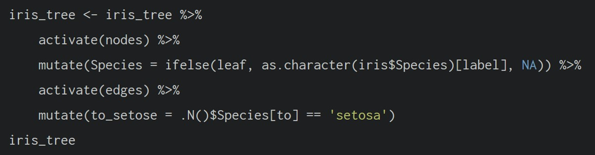

# **27  Chapter 27: Modelling, Visualising and Analysing Network Data with R**

---
title: "Hands-on Ex 09a"
author: "Edward"
date: 11 Mar 2026
---

```{r}
options(warn = -1)
```

## **27.2 Getting Started**

### **27.2.1 Installing and launching R packages**

```{r}
pacman::p_load(igraph, tidygraph, ggraph, 
               visNetwork, lubridate, clock,
               tidyverse, graphlayouts, 
               concaveman, ggforce)
```

## **27.3 The Data**

### **27.3.3 Importing network data from files**

```{r}
GAStech_nodes <- read_csv("data/GAStech_email_node.csv")
GAStech_edges <- read_csv("data/GAStech_email_edge-v2.csv")
```

### **27.3.4 Reviewing the imported data**

```{r}
glimpse(GAStech_edges)
```

### **27.3.5 Wrangling time**

Changing SendDate to Date type.

```{r}
GAStech_edges <- GAStech_edges %>%
  mutate(SendDate = dmy(SentDate)) %>%
  mutate(Weekday = wday(SentDate,
                        label = TRUE,
                        abbr = FALSE))
```

### **27.3.6 Reviewing the revised date fields**

```{r}
glimpse(GAStech_edges)
```

### **27.3.7 Wrangling attributes**

```{r}
GAStech_edges_aggregated <- GAStech_edges %>%
  filter(MainSubject == "Work related") %>%
  group_by(source, target, Weekday) %>%
    summarise(Weight = n()) %>%
  filter(source!=target) %>%
  filter(Weight > 1) %>%
  ungroup()
```

### **27.3.8 Reviewing the revised edges file**

```{r}
glimpse(GAStech_edges)
```

## **27.4 Creating network objects using tidygraph**

### **27.4.1 The tbl_graph object**

Two functions of **tidygraph** package can be used to create network objects, they are:

-   [`tbl_graph()`](https://tidygraph.data-imaginist.com/reference/tbl_graph.html) creates a **tbl_graph** network object from nodes and edges data.

-   [`as_tbl_graph()`](https://tidygraph.data-imaginist.com/reference/tbl_graph.html) converts network data and objects to a **tbl_graph** network. Below are network data and objects supported by `as_tbl_graph()`

### **27.4.2 The dplyr verbs in tidygraph**

In tidygraph there are 2 main component (internal tables) \>\>Nodes, Edges

The purpose of activate() allows us to toggle between the 2 internal tables



***.N()*** **function** is used to gain access to the node data while manipulating the edge data.

***.E()*** will give you the edge data.

***.G()*** will give you the **tbl_graph** object itself.

### **27.4.3 Using `tbl_graph()` to build tidygraph data model.**

```{r}
GAStech_graph <- tbl_graph(nodes = GAStech_nodes,
                           edges = GAStech_edges_aggregated, 
                           directed = TRUE)
```

### **27.4.4 Reviewing the output tidygraph’s graph object**

```{r}
GAStech_graph
```

### **27.4.5 Reviewing the output tidygraph’s graph object**

### **27.4.6 Changing the active object**

The nodes tibble data frame is activated by default.

To rearrange the rows in the edges tibble to list those with the highest “weight” first, we could use *activate()* and then *arrange()*.

```{r}
GAStech_graph %>%
  activate(edges) %>%
  arrange(desc(Weight))
```

## **27.5 Plotting Static Network Graphs with ggraph package**

As in all network graph, there are three main aspects to a **ggraph**’s network graph, they are:

-   [nodes](https://cran.r-project.org/web/packages/ggraph/vignettes/Nodes.html),

-   [edges](https://cran.r-project.org/web/packages/ggraph/vignettes/Edges.html) and

-   [layouts](https://cran.r-project.org/web/packages/ggraph/vignettes/Layouts.html).

### **27.5.1 Plotting a basic network graph**

```{r}
ggraph(GAStech_graph) +
  geom_edge_link() +
  geom_node_point()
```

### **27.5.2 Changing the default network graph theme**

```{r}
g <- ggraph(GAStech_graph) + 
  geom_edge_link(aes()) +
  geom_node_point(aes())

g + theme_graph()
```

-   **ggraph** introduces a special ggplot theme that provides better defaults for network graphs than the normal ggplot defaults. `theme_graph()`, besides removing axes, grids, and border, changes the font to Arial Narrow (this can be overridden).

-   The ggraph theme can be set for a series of plots with the `set_graph_style()` command run **before the graphs are plotted** or by using `theme_graph()` in the individual plots.

### **27.5.3 Changing the coloring of the plot**

```{r}

g <- ggraph(GAStech_graph) + 
  geom_edge_link(aes(colour = 'grey50')) +
  geom_node_point(aes(colour = 'grey40'))

g + theme_graph(background = 'grey10',
                text_colour = 'white')
```

### **27.5.4 Working with ggraph’s layouts**

**ggraph** support many layout for standard used, they are: star, circle, nicely (default), dh, gem, graphopt, grid, mds, spahere, randomly, fr, kk, drl and lgl.

### **27.5.5 Fruchterman and Reingold layout**

```{r}
g <- ggraph(GAStech_graph, 
            layout = "fr") +
  geom_edge_link(aes()) +
  geom_node_point(aes())

g + theme_graph()
```

### **27.5.6 Modifying network nodes**

```{r}

g <- ggraph(GAStech_graph, 
            layout = "nicely") + 
  geom_edge_link(aes()) +
#Simple plotting of nodes in different shapes, colours and sizes
  geom_node_point(aes(colour = Department, 
                      size = 3))

g + theme_graph()
```

### **27.5.7 Modifying edges**

Thickness of the edges will be mapped with the *Weight* variable

```{r}

g <- ggraph(GAStech_graph, 
            layout = "nicely") +
  geom_edge_link(aes(width=Weight), 
                 alpha=0.2) +
  scale_edge_width(range = c(0.1, 5)) +
  geom_node_point(aes(colour = Department), 
                  size = 3)

g + theme_graph()
```

## **27.6 Creating facet graphs**

**Faceting** can be used to reduce edge over-plotting in a very meaning way by spreading nodes and edges out based on their attributes. 

There are three functions in ggraph to implement faceting, they are:

-   [*facet_nodes()*](https://ggraph.data-imaginist.com/reference/facet_nodes.html) whereby edges are only draw in a panel if **both terminal nodes are present** here,

-   [*facet_edges()*](https://ggraph.data-imaginist.com/reference/facet_edges.html) whereby nodes are always **drawn in all panels** even if the node data contains an attribute named the same as the one used for the edge facetting, and

-   [*facet_graph()*](https://ggraph.data-imaginist.com/reference/facet_graph.html) faceting on **two variables simultaneously**.

### **27.6.1 Working with *facet_edges()***

```{r}

set_graph_style()

g <- ggraph(GAStech_graph, 
            layout = "nicely") + 
  geom_edge_link(aes(width=Weight), 
                 alpha=0.2) +
  scale_edge_width(range = c(0.1, 5)) +
  geom_node_point(aes(colour = Department), 
                  size = 2)

g + facet_edges(~Weekday)
```

### **27.6.2 F*acet_edges() - Legend position***

There are three functions in ggraph to implement faceting, they are:

```{r fig.width=10, fig.height=8}

set_graph_style()

g <- ggraph(GAStech_graph, 
            layout = "nicely") + 
  geom_edge_link(aes(width=Weight), 
                 alpha=0.2) +
  scale_edge_width(range = c(0.1, 5)) +
  geom_node_point(aes(colour = Department), 
                  size = 2) +
  theme(legend.text = element_text(size = 10),
        legend.position = 'bottom',
        plot.margin = margin(10, 60, 10, 10))
  
g + facet_edges(~Weekday)
```

### **27.6.3 A framed facet graph**

```{r fig.width=10, fig.height=8}
set_graph_style() 

g <- ggraph(GAStech_graph, 
            layout = "nicely") + 
  geom_edge_link(aes(width=Weight), 
                 alpha=0.2) +
  scale_edge_width(range = c(0.1, 5)) +
  geom_node_point(aes(colour = Department), 
                  size = 2)
  
g + facet_edges(~Weekday) +
  th_foreground(foreground = "grey80",  
                border = TRUE) +
  theme(legend.position = 'bottom')
```

### **27.6.4 Working with *facet_nodes()***

This function is equivalent to [`ggplot2::facet_wrap()`](https://ggplot2.tidyverse.org/reference/facet_wrap.html) but only facets nodes. Edges are drawn if their terminal nodes are both present in a panel.

```{r fig.width=10, fig.height=5}
set_graph_style()

g <- ggraph(GAStech_graph, 
            layout = "nicely") + 
  geom_edge_link(aes(width=Weight), 
                 alpha=0.2) +
  scale_edge_width(range = c(0.1, 5)) +
  geom_node_point(aes(colour = Department), 
                  size = 2)
  
g + facet_nodes(~Department)+
  th_foreground(foreground = "grey80",  
                border = TRUE) +
  theme(legend.position = 'bottom')
```

## **27.7 Network Metrics Analysis**

### **27.7.1 Computing centrality indices**

```{r fig.width=10, fig.height=7}
g <- GAStech_graph %>%
  mutate(betweenness_centrality = centrality_betweenness()) %>%
  ggraph(layout = "fr") + 
  geom_edge_link(aes(width=Weight), 
                 alpha=0.2) +
  scale_edge_width(range = c(0.1, 5)) +
  geom_node_point(aes(colour = Department,
            size=betweenness_centrality))
g + theme_graph()
```

```{r fig.width=10, fig.height=7}
g <- GAStech_graph %>%
  activate(nodes) %>%
  mutate(community = as.factor(
    group_optimal(weights = Weight)),
         betweenness_measure = centrality_betweenness()) %>%
  ggraph(layout = "fr") +
  geom_mark_hull(
    aes(x, y, 
        group = community, 
        fill = community),  
    alpha = 0.2,  
    expand = unit(0.3, "cm"),  # Expand
    radius = unit(0.3, "cm")  # Smoothness
  ) + 
  geom_edge_link(aes(width=Weight), 
                 alpha=0.2) +
  scale_edge_width(range = c(0.1, 5)) +
  geom_node_point(aes(fill = Department,
                      size = betweenness_measure),
                      color = "black",
                      shape = 21)
  
g + theme_graph()
```

## **27.8 Building Interactive Network Graph with visNetwork**

### **27.8.1 Data preparation**

```{r}
GAStech_edges_aggregated <- GAStech_edges %>%
  left_join(GAStech_nodes, by = c("sourceLabel" = "label")) %>%
  rename(from = id) %>%
  left_join(GAStech_nodes, by = c("targetLabel" = "label")) %>%
  rename(to = id) %>%
  filter(MainSubject == "Work related") %>%
  group_by(from, to) %>%
    summarise(weight = n()) %>%
  filter(from!=to) %>%
  filter(weight > 1) %>%
  ungroup()
```

### **27.8.2 Plotting the first interactive network graph**

The code below will be used to plor an interactiove network graph.

**visNetwork(GAStech_nodes, GAStech_edges_aggregated)**

### **27.8.3 Working with layout**

**visNetwork()** looks for a field called “group” in the nodes object and colour the nodes according to the values of the group field.

```{r}
visNetwork(GAStech_nodes,
           GAStech_edges_aggregated) %>%
  visIgraphLayout(layout = "layout_with_fr") 
```

### **27.8.4 Working with visual attributes - Nodes**

**visNetwork()** looks for a field called “group” in the nodes object and colour the nodes according to the values of the group field.

```{r}
GAStech_nodes <- GAStech_nodes %>%
  rename(group = Department)
```

```{r}
visNetwork(GAStech_nodes,
           GAStech_edges_aggregated) %>%
  visIgraphLayout(layout = "layout_with_fr") %>%
  visLegend() %>%
  visLayout(randomSeed = 123)
```

### **27.8.5 Working with visual attributes - Edges**

In the code run below ***visEdges()*** is used to symbolise the edges.\
- The argument *arrows* is used to define where to place the arrow.\
- The *smooth* argument is used to plot the edges using a smooth curve.

```{r}
visNetwork(GAStech_nodes,
           GAStech_edges_aggregated) %>%
  visIgraphLayout(layout = "layout_with_fr") %>%
  visEdges(arrows = "to", 
           smooth = list(enabled = TRUE, 
                         type = "curvedCW")) %>%
  visLegend() %>%
  visLayout(randomSeed = 123)
```

### **27.8.6 Interactivity**

In the code chunk below, *visOptions()* is used to incorporate interactivity features in the data visualisation.

-   The argument ***highlightNearest*** highlights nearest when clicking a node.

-   The argument ***nodesIdSelection*** adds an id node selection creating an HTML select element.

```{r}
visNetwork(GAStech_nodes,
           GAStech_edges_aggregated) %>%
  visIgraphLayout(layout = "layout_with_fr") %>%
  visOptions(highlightNearest = TRUE,
             nodesIdSelection = TRUE) %>%
  visLegend() %>%
  visLayout(randomSeed = 123)
```
